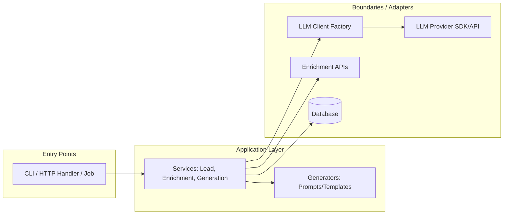

# Architecture

This document describes the high-level architecture of the **Tecnoleads** repository. The project is structured as a **modular monolith** focused on “lead” workflows (capture → enrichment → scoring/qualification → outreach/content generation). The architecture is designed to keep **business logic testable and easy to change**, while isolating **side effects** (I/O, network calls, persistence) behind clear boundaries.

---

## Goals & Principles

The current design optimizes for:

- **Fast iteration on business rules**: favor explicit service-layer composition over heavy framework coupling.
- **Clear seams between core logic and integrations**: providers/adapters hide vendor SDK complexity.
- **Testability**: keep pure orchestration and decision logic in services; push I/O to boundary modules.
- **Extensibility**: add/swap enrichment sources, outbound channels, and LLM providers with minimal churn.

---

## System Topology

- **Topology:** Modular monolith (single deployable unit; modules are separated by directory boundaries and stable contracts).
- **Deployment model:** Typically a single Node.js runtime artifact (web app, CLI, job runner, or serverless handlers) invoking the same service layer.

### Conceptual request traversal

1. **Entry Point** (HTTP route/handler, CLI command, job) receives input and loads configuration.
2. **Controller/Handler** validates and maps transport input into a domain command/query.
3. **Service layer** orchestrates lead workflows:
   - create/update lead
   - enrichment pipeline
   - scoring/qualification
   - message/content generation
4. **Boundary modules** perform I/O:
   - database reads/writes
   - external API calls (enrichment, LLMs, outbound email/CRM)
5. **Response mapping** returns data to the entry point (JSON response, console output, etc.)

**Key control pivots**
- **Entry Point → Services:** transport-specific concerns end here.
- **Services → Providers/Repositories:** deterministic logic yields to I/O/integration behavior.

---

## Architectural Layers

The repository follows conventional separation (names may vary per runtime/app):

### 1) Entry Points
Runtime-facing modules that bootstrap configuration and call services:
- HTTP handlers / server routes
- CLI commands
- scheduled jobs / workers

Typical file conventions (if present): `src/index.*`, `src/server.*`, `src/cli.*`, `src/handlers/*`.

### 2) Application / Service Layer
Use-cases and orchestration logic:
- lead lifecycle operations
- enrichment/qualification flows
- content generation orchestration
- coordination of repositories/providers

Common convention: `src/services/`.

### 3) Generators (Content & Templates)
Prompt building, templating, personalization, output shaping for outbound messages.

Common convention: `src/generators/`.

### 4) Domain Models
Core types/entities/value objects and domain rules.

Common convention: `src/domain/` or `src/models/`.

### 5) Persistence / Data Access
Repositories, migrations, and database adapters.

Common convention: `src/repositories/`, `src/db/`, `prisma/`, `migrations/`.

### 6) Integrations / Providers (Boundary Layer)
External service adapters:
- enrichment vendors
- LLM providers
- email/CRM/outbound systems

Common convention: `src/integrations/`, `src/providers/`, `src/clients/`.

### 7) Shared Utilities
Cross-cutting helpers such as formatting, logging, config, validation, errors.

In this repo, a confirmed utilities location is:
- `apps/web/lib` (see [`apps/web/lib/utils.ts`](../apps/web/lib/utils.ts))

---

## Current Confirmed Structure (Web App Utilities)

### `apps/web/lib`

This folder contains shared utilities for the web application.

#### `cn` utility (public API)

- **Symbol:** `cn`
- **Type:** function
- **Location:** `apps/web/lib/utils.ts`

`cn` is exported as part of the app’s utility surface. It is typically used to compose CSS class names in a safe/ergonomic way (often combining conditional class strings). Refer to the implementation for exact behavior:

```ts
import { cn } from "@/lib/utils";

const className = cn(
  "base",
  isActive && "active",
  isDisabled ? "opacity-50" : "opacity-100",
);
```

> See: [`apps/web/lib/utils.ts`](../apps/web/lib/utils.ts)

---

## Bounded Contexts (Suggested Domain Partitioning)

The system is easiest to reason about when split by lead lifecycle:

### Lead Management
Owns lead identity, lifecycle state, and canonical lead records.

- **Responsibilities:** create/update lead, dedupe, transitions (new → enriched → qualified → contacted)
- **Data ownership:** Lead record + status transitions

### Enrichment & Qualification
Owns enrichment sources and scoring rules.

- **Responsibilities:** enrichment orchestration, scoring, qualification decision
- **Data strategy:** write derived enrichment results back to lead storage with provenance (source + timestamp)

### Content Generation & Outreach
Owns message composition and outbound channel policies.

- **Responsibilities:** draft generation, personalization, channel formatting (email/LinkedIn/etc.)
- **Integration policy:** services should depend on a stable internal `LLMClient` interface (produced by a factory) rather than vendor SDKs.

---

## Integration Patterns

The repository design encourages a few repeatable patterns:

### Service Layer
Services implement use-cases and orchestrate flows. Keep them:
- small and use-case focused
- explicit about steps (validate → enrich → score → generate → persist)
- independent of transport (HTTP/CLI/etc.)

### Provider/Adapter Boundary
External SDKs and APIs should be wrapped to:
- normalize payloads into domain contracts
- centralize auth/retries/timeouts/error mapping
- prevent vendor shapes from leaking into domain models

### Factories (e.g., LLM client selection)
A factory centralizes provider selection and configuration (useful for multi-provider setups or fallback strategies).

---

## Cross-cutting Concerns

Centralize these concerns so feature modules remain focused:

- **Configuration:** environment variables, secrets, per-env config
- **Logging/observability:** structured logs, correlation IDs for multi-step pipelines
- **Error normalization:** consistent error types across providers
- **Retries/backoff:** especially for rate-limited vendors (LLMs/enrichment)
- **Validation:** enforce schemas at the boundary and before persistence

---

## Diagram (Conceptual)



---

## Risks & Constraints

- **Rate limits & cost (LLMs/enrichment):** add quotas, caching, batching, and backpressure.
- **Data quality drift:** vendor payload changes; keep mapping/validation in adapters.
- **LLM nondeterminism:** control temperature, prefer structured outputs, validate before persisting/sending.
- **Operational observability:** ensure correlation IDs across pipeline stages.
- **Privacy/compliance:** leads may contain PII; enforce retention policies and avoid leaking sensitive data into prompts.

---

## Related Documentation

- [`project-overview.md`](./project-overview.md)
- [`data-flow.md`](./data-flow.md)
- [`codebase-map.json`](./codebase-map.json)
