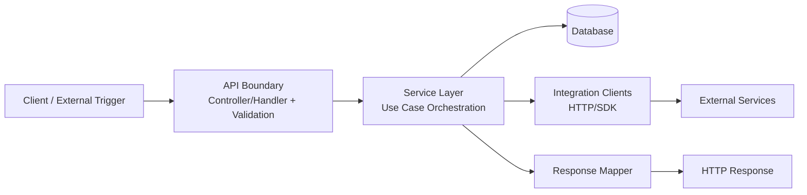

## Data Flow & Integrations

This document describes how data enters the system, how it is transformed as it moves through application layers, and how it is persisted and/or exchanged with external services.

At a high level, the system follows a layered architecture:

- **Ingress (API/UI):** Requests enter through HTTP endpoints (controllers/handlers) and are validated/normalized.
- **Application/Service layer:** Business operations are executed by service classes that orchestrate workflows, enforce invariants, and coordinate data access and integrations.
- **Domain/data access layer:** Repositories/ORM models perform persistence operations and queries.
- **Egress (integrations/webhooks/exports):** The system sends data to external services (or triggers side effects) via adapters/clients.

Data typically moves through the following stages:

1. **Request intake**
   - Input arrives as HTTP request payloads (JSON, form-data) or scheduled/background triggers.
   - Validation and basic normalization happen at the boundary (DTO/schema validation, required fields, type coercion).
2. **Business processing**
   - Services receive validated inputs and apply business rules.
   - Services may:
     - read/write database entities,
     - call other services (internal orchestration),
     - call external integrations via client/adapters.
3. **Persistence**
   - Entities are created/updated in the database using repositories/models.
   - Transactions (if used) wrap multi-step operations to ensure consistency.
4. **Output**
   - HTTP responses return success/failure with relevant data.
   - Side effects (notifications, third-party sync, exports) are emitted synchronously or asynchronously depending on module design.

Where integrations exist, the data flow explicitly delineates:
- **Outbound:** domain objects → integration-specific payloads (mapping/transform) → external API request.
- **Inbound:** external responses/webhooks → verification/auth → normalization → persistence/workflow triggering.

For system-wide architectural context and boundaries, see: [architecture.md](./architecture.md).

---

## Module Dependencies

> Cross-module dependencies (who depends on whom). Paths are repository-relative.

- **docs/** → `architecture.md` (documentation cross-reference)
- **src/** → `utils`, `config` (shared runtime configuration and helpers)
- **services/** → `utils` (business orchestration uses shared helpers)

> Note: The repository scaffold indicates `src/` and `services/` conventions, but the exact dependency graph should be refined once module boundaries are finalized and/or once the module map is implemented in code.

---

## Service Layer

> Service classes responsible for orchestrating business flows.
> Links should point to the implementation files once present in the repository.

- _No concrete service implementations were discoverable from the provided scaffold context._
- Recommended convention (when implemented):
  - `services/<Domain>Service.<ext>` (primary orchestration)
  - `services/<Domain>Repository.<ext>` or `src/<domain>/repository.<ext>` (persistence boundary)
  - `src/integrations/<Provider>Client.<ext>` (external integration boundary)

If/when service implementations exist, list them here as:

- **`<ServiceName>`** → `services/<path-to-file>`
- **`<ServiceName>`** → `src/<path-to-file>`

---

## High-level Flow

The primary pipeline is a request-driven flow:

1. **Client** sends a request (API/UI).
2. **API layer** validates input and converts it into an internal command/DTO.
3. **Service layer** executes a use case:
   - reads current state from persistence,
   - applies business rules,
   - persists changes,
   - triggers integration calls if required.
4. **Persistence layer** commits changes.
5. **API layer** returns response; optionally emits events/notifications.

### Mermaid (conceptual)

This is an architectural view (not a guarantee of implementation). Once concrete modules exist, refine nodes to match actual components (controllers, services, repositories, queues, workers).

---

## Internal Movement

Internal collaboration patterns typically used/expected in this architecture:

- **Synchronous service orchestration**
  - Services call other services directly when strict ordering/consistency is required.
  - Prefer explicit method contracts (DTOs/commands) rather than leaking persistence entities across modules.
- **Shared persistence**
  - Domain state is stored in a database and is the source of truth.
  - Services should treat persistence boundaries as a contract (repositories) to keep business logic testable.
- **Asynchronous side effects (recommended where appropriate)**
  - For non-critical integrations (analytics, notifications, third-party sync), prefer background jobs/queues to reduce API latency and isolate failures.
  - If a queue is introduced, define:
    - message schema/versioning,
    - idempotency keys,
    - retry and dead-letter policies.

---

## External Integrations

> The scaffold does not enumerate concrete providers. The list below defines the standard integration contract to document each provider consistently. Populate with actual providers when implemented.

- **`<IntegrationName>`**
  - **Purpose:** What business capability it provides (e.g., CRM sync, email delivery, payments).
  - **Direction:** outbound | inbound (webhook) | both
  - **Authentication:**
    - API key / OAuth2 / HMAC signature / mTLS
    - Token storage and rotation strategy
  - **Endpoints / Events:**
    - Outbound endpoints used (paths + verbs)
    - Inbound webhook events (event types) and verification steps
  - **Payload shape (high level):**
    - Request: internal model → integration DTO mapping
    - Response: expected fields and error shapes
  - **Retry strategy:**
    - Which errors are retried (timeouts/5xx) vs. not retried (4xx validation)
    - Backoff: exponential with jitter
    - Maximum attempts / time budget
  - **Idempotency:**
    - Idempotency keys for POST/PUT
    - Deduplication strategy for webhooks
  - **Rate limiting & throttling:**
    - Provider limits
    - Client-side throttling/circuit breaking policy
  - **Data protection:**
    - Sensitive fields redaction in logs
    - Encryption at rest/in transit requirements

---

## Observability & Failure Modes

Observability should follow the data flow boundaries:

- **Logging**
  - Correlate logs with a request/trace ID propagated from ingress → services → integrations.
  - Log at boundaries:
    - request validation failures (without sensitive payloads),
    - service-level business outcomes,
    - integration requests/responses (redacted),
    - persistence errors.
- **Metrics**
  - Recommended counters/timers:
    - request rate, latency (p50/p95/p99), error rate by endpoint/use case,
    - DB query latency and failure counts,
    - integration call latency, retry counts, provider error rates,
    - queue depth / job latency (if asynchronous workers exist).
- **Tracing**
  - Distributed tracing spans:
    - API handler span
    - service use-case span
    - DB spans
    - external HTTP spans
- **Failure modes & handling**
  - **Validation errors:** return 4xx with actionable field errors.
  - **Business rule violations:** return domain-specific errors; avoid partial writes.
  - **Transient integration failures:** retry with exponential backoff; consider circuit breaker to prevent cascading failures.
  - **Non-transient integration failures (4xx):** do not retry; persist failure state for manual remediation if needed.
  - **Asynchronous failures:** route to dead-letter queue (DLQ) after max retries; provide replay tooling.
  - **Compensating actions:** for multi-step workflows across boundaries (DB + external API), document compensations (e.g., revert local state, mark as “pending_sync”, schedule reconciliation).

---

## Related Resources

- [architecture.md](./architecture.md)
